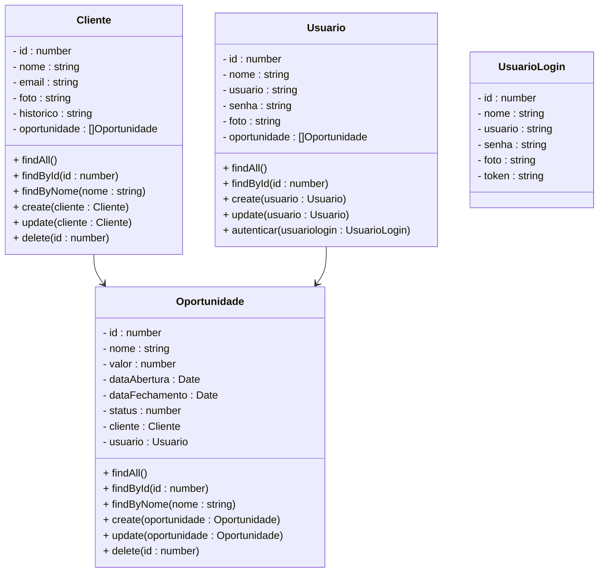

# Projeto CRM - Backend

 

    

  

## 1. Descrição

**CRM (Customer Relationship Management)** é um conceito que abrange estratégias, práticas e tecnologias usadas por empresas para gerenciar e analisar as interações com seus clientes e potenciais clientes ao longo de todo o ciclo de relacionamento. O objetivo principal de um sistema CRM é melhorar o atendimento, aumentar a fidelização e, como resultado, impulsionar as vendas.

Um sistema de CRM oferece diversos benefícios:

1. Centralização de dados
2. Personalização do atendimento
3. Automação de tarefas
4. Análise de desempenho

Esses sistemas geralmente operam por meio de plataformas web ou aplicativos móveis, permitindo que os usuários cadastrem clientes, gerenciem oportunidades de negócios e acompanhem relatórios de desempenho em tempo real.

------

## 2. Sobre esta API

Neste projeto, será desenvolvido um **Mínimo Produto Viável (MVP)** de um sistema de **CRM**, implementando os CRUDs (Create, Read, Update, Delete) para os principais registros de um sistema de gestão de relacionamento com o cliente. Esses registros são essenciais para permitir que empresas gerenciem de forma eficiente suas interações com os clientes. A solução abrangerá as três entidades mais comuns em um sistema CRM:

1. **Usuários**: Representam os funcionários ou operadores que utilizam o sistema de CRM para gerenciar clientes e vendas.  
   **Exemplo:** Daphne é vendedora em uma empresa de software e utiliza o sistema CRM. Ela possui permissões para criar e gerenciar oportunidades de venda para seus clientes.
2. **Clientes**: Representam os clientes finais ou empresas com as quais a organização mantém ou deseja iniciar um relacionamento comercial.  
   **Exemplo:** Velma é cliente da empresa de software e foi cadastrada no CRM por Daphne para facilitar o acompanhamento das negociações e futuras interações.

3. **Oportunidades**: São as possibilidades de vendas ou novos negócios com clientes.  
   **Exemplo:** Daphne identificou uma **oportunidade** para vender um novo Sistema de Gestão para Velma. Ela registrou a oportunidade no CRM, com um valor estimado de R$ 15.000 e uma previsão de fechamento em 30 dias.

 

### 2.1. Exemplo Prático - Fluxo no CRM:

1. O **Usuário** cadastra um **Cliente** no sistema.
2. O usuário cria uma **Oportunidade** de negócio associada a esse cliente, detalhando o produto ou serviço em negociação. O status inicial da oportunidade será **Aberta (1)**.
3. Se a negociação for bem-sucedida, a **Oportunidade** é convertida em uma venda, e o status muda para **Fechada (2)**.
4. Caso a negociação não seja concluída, o status será alterado para **Perdida (3)**, mas o **Cliente** permanece registrado no sistema para futuras interações.

### 2.2. Principais Funcionalidades

1. Cadastro e gerenciamento de usuários
2. Registro e gerenciamento de clientes
3. Criação e gerenciamento de oportunidades
4. Alteração do status

------

## 3. Diagrama de Classes

**Observações Importantes:**

- O atributo **status**, da entidade **Oportunidade**, foi definido com o tipo **number** e receberá apenas os seguintes valores:
  - **1** - *Aberta*
  - **2** - *Fechada*
  - **3** - *Perdida*
- O método **mudarStatus** deve atender a alguns requisitos:
  - Receber os parâmetros do tipo number **id e status**
  - Verificar se o status recebido é um **número inteiro entre 1 e 3**
  - O método não deve aceitar a mudança de status caso o status atual já seja **3 (Perdida)**
  - Caso todas as condições sejam satisfeitas, o único valor alterado será o **status**

------

## 4. Diagrama Entidade-Relacionamento (DER)

    

------

## 5. Tecnologias utilizadas

| Item                          | Descrição  |
| ----------------------------- | ---------- |
| **Servidor**                  | Node JS    |
| **Linguagem de programação**  | TypeScript |
| **Framework**                 | Nest JS    |
| **ORM**                       | TypeORM    |
| **Banco de dados Relacional** | MySQL      |

------

## 6. Configuração e Execução

1. Clone o repositório
2. Instale as dependências: `npm install`
3. Configure o banco de dados no arquivo `app.module.ts`
4. Execute a aplicação: `npm run start:dev`

